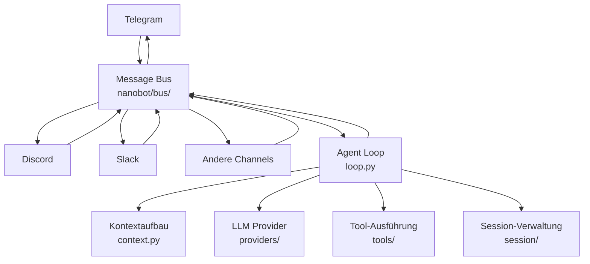

# Gateway-Service

## Was ist das Gateway?

Der Gateway ist der lang laufende Service von nanobot, der alle verbundenen Chat-Plattformen (Telegram, Discord, Slack, Feishu, DingTalk etc.) orchestriert und eingehende Nachrichten an den Agenten-Loop weiterleitet.

Nach dem Start übernimmt das Gateway:

1. Laden der Konfiguration und Initialisierung aller aktivierten Channels
2. Aufbau der Message Bus-Infrastruktur
3. Start eigener Listener pro Channel
4. Permanente Verarbeitung eingehender Nachrichten durch den Agenten
5. Rückgabe der Antworten über die entsprechenden Kanäle

## Architektur



Nachrichtenfluss:

```
Channel empfängt Nachricht
  → Message Bus (InboundMessage)
    → Agent Loop
      → Kontext (History + Memory + Skills)
      → LLM-Aufruf
      → Tool-Ausführung (falls nötig)
      → Antwort generieren
  → Message Bus (OutboundMessage)
→ Channel sendet Antwort
```

## Gateway starten

### Standardstart

```bash
nanobot gateway
```

Verwendet `~/.nanobot/config.json` und Port `18790`.

### Anderen Config-Pfad nutzen

```bash
nanobot gateway --config ~/.nanobot-telegram/config.json
```

### Port angeben

```bash
nanobot gateway --port 18792
```

### Workspace übergeben

```bash
nanobot gateway --workspace /path/to/workspace
```

### Kombinierte Optionen

```bash
nanobot gateway --config ~/.nanobot-feishu/config.json --port 18792
```

## Mehrere Instanzen

```bash
nanobot gateway --config ~/.nanobot-telegram/config.json
nanobot gateway --config ~/.nanobot-discord/config.json
nanobot gateway --config ~/.nanobot-feishu/config.json --port 18792
```

> Wichtig: Jeder Gateway braucht einen eigenen Port, z. B. `18790`, `18791`, `18792`.

Port-Option im Config:

```json
{
  "gateway": {
    "port": 18790
  }
}
```

## Heartbeat-Service

Nanobot bietet einen Heartbeat-Service, der alle 30 Minuten `HEARTBEAT.md` im Workspace ausliest.

### Ablauf

1. Gateway liest `~/.nanobot/workspace/HEARTBEAT.md`
2. Enthält die Datei Aufgaben, führt der Agent sie aus
3. Ergebnisse werden an den zuletzt aktiven Channel gesendet

### Nur ein Beispiel

```markdown
- [ ] Heute 9 Uhr Wetter melden
- [ ] Freitag Nachmittag an Weekly Report erinnern
- [ ] Jede Stunde wichtige E-Mails prüfen
```

> Tipp: Sag dem Bot „Füge einen periódischen Task hinzu“ – er aktualisiert `HEARTBEAT.md` selbst.

### Voraussetzungen

- Gateway läuft (`nanobot gateway`)
- Du hast mindestens einmal mit dem Bot geschrieben

## Status prüfen

### Gesamtstatus

```bash
nanobot status
```

Zeigt Version, konfigurierte Provider und Workspace.

### Channel-Status

```bash
nanobot channels status
```

Liste der aktiven Channels und deren Verbindungsstatus.

### Plugin-Liste

```bash
nanobot plugins list
```

Zeigt integrierte Channels und externe Plugins.

## Graceful Shutdown

`Ctrl+C` löst einen sauberen Shutdown aus:

1. Gateway empfängt SIGINT/SIGTERM
2. Listener stoppen
3. In Bearbeitung befindliche Anfragen abschließen
4. Ressourcen freigeben

Bei systemd:

```bash
systemctl --user stop nanobot-gateway
```

## Kommando-Quick-Reference

| Kommando | Beschreibung |
|----------|--------------|
| `nanobot gateway` | Gateway starten |
| `nanobot gateway --port 18792` | Gateway auf Port starten |
| `nanobot gateway --config <path>` | Spezifische Config nutzen |
| `nanobot status` | Systemstatus anzeigen |
| `nanobot channels status` | Channel-Status prüfen |
| `nanobot plugins list` | Pluginkonfiguration anzeigen |
| `nanobot onboard` | Onboarding-Assistent starten |
