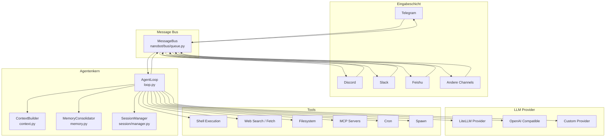
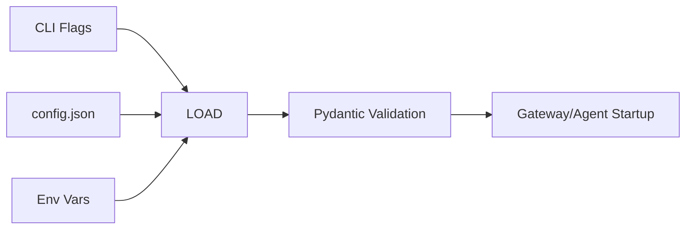

# Architekturübersicht

## Designprinzipien

nanobot folgt einer **ereignisgetriebenen, asynchronen** Architektur, um mit minimalem Code einen vollständigen Agenten bereitzustellen. Wichtige Prinzipien:

- **Message Bus:** Einheitliche Kommunikation zwischen Komponenten
- **Asynchrone Coroutinen:** Effizient bei hoher Parallelität
- **Lose Kopplung:** Jede Komponente kann unabhängig weiterentwickelt werden
- **Single Responsibility:** Module erfüllen genau eine Aufgabe

## Architekturdiagramm



## Nachrichtenfluss

```mermaid
sequenceDiagram
    participant CH as Channel Interface
    participant BUS as Message Bus
    participant LOOP as Agent Loop
    participant CTX as Context Builder
    participant LLM as LLM Provider
    participant TOOLS as Tool Executor
    participant SESS as Session Manager

    CH->>BUS: InboundMessage (Inhalt, Absender, Channel)
    BUS->>LOOP: Verteilt an Agent Loop
    LOOP->>SESS: Session laden/erstellen
    LOOP->>CTX: Kontext aufbauen
    CTX->>CTX: System-Prompts, AGENTS.md, Memory, Skills
    LOOP->>LLM: LLM-Aufruf (System + History + neue Message)
    LLM-->>LOOP: Antwort oder Tool-Aufruf

    loop Tools (max. 40 Iterationen)
        LOOP->>TOOLS: Tool ausführen (Shell, Web, FS, MCP...)
        TOOLS-->>LOOP: Ergebnis
        LOOP->>LLM: Weitere LLM-Invokation
        LLM-->>LOOP: Antwort o. nächster Call
    end

    LOOP->>SESS: Dialog-Historie speichern
    LOOP->>BUS: OutboundMessage (Antwort)
    BUS->>CH: Antwort zurück an Channel
```

## Kernmodule

### CLI-Einstiegspunkt (`nanobot/cli/commands.py`)

Alle CLI-Befehle starten hier. Nach Parameter-Parsing greift der Code auf die jeweiligen Subcommands (`gateway`, `agent`, `status`, `onboard`) zu.

```bash
nanobot gateway   # Gateway starten
nanobot agent     # Lokaler CLI-Agent
nanobot status    # Status anzeigen
nanobot onboard   # Onboarding-Assistent
```

### Message Bus (`nanobot/bus/`)

Zentrale Routing-Schicht:

- `InboundMessage` von Channels empfangen
- Verteilung an den Agent Loop
- `OutboundMessage` zurück zu Channels

```python
@dataclass
class InboundMessage:
    channel: str
    sender_id: str
    chat_id: str
    content: str
    media: list[str]
    metadata: dict

@dataclass
class OutboundMessage:
    channel: str
    chat_id: str
    content: str
    media: list[str]
    metadata: dict  # z. B. "_progress" für Streaming
```

### Agent Loop (`nanobot/agent/loop.py`)

Zyklus:

1. Nachricht vom Bus empfangen
2. `ContextBuilder` erzeugt Prompt
3. LLM aufrufen
4. Tools ausführen (wenn nötig)
5. Solange wiederholen, bis der LLM eine finale Antwort liefert
6. Antwort zurück in den Bus schreiben

Konfiguration:

```python
AgentLoop(
    bus=bus,
    provider=provider,
    workspace=workspace,
    max_iterations=40,
    context_window_tokens=65_536,
    restrict_to_workspace=False,
)
```

### Context Builder (`nanobot/agent/context.py`)

Fügt für jeden LLM-Aufruf zusammen:

- Agent-Identität
- `AGENTS.md`, `SOUL.md`, `USER.md`, `TOOLS.md` (falls vorhanden)
- Memory-Summaries
- Aktivierte Skills
- Skill-Verzeichnis
- Dialog-Historie

### Memory (`nanobot/agent/memory.py`)

- `MemoryStore`: Speichert Memory-Dateien im Workspace
- `MemoryConsolidator`: Komprimiert lange Chroniken, wenn Token-Limit erreicht ist

Ablauf:

```
History > Kontextlimit
→ MemoryConsolidator fasst zusammen
→ Zusammenfassung in memory.md speichern
→ Alte Einträge aus History entfernen
```

### Channels (`nanobot/channels/`)

Jede Plattform implementiert `BaseChannel`:

```
channels/
├── base.py
├── telegram.py
├── discord.py
├── slack.py
├── feishu.py
├── dingtalk.py
├── wecom.py
├── qq.py
├── email.py
├── matrix.py
├── whatsapp.py
└── mochat.py
```

Jede Channel-Klasse implementiert:

- `start()`: Verbindung aufbauen (muss blockieren)
- `stop()`: Graceful Shutdown
- `send(msg)`: Nachricht senden

### Provider (`nanobot/providers/`)

`Provider`-Abstraktion, u.a. `LiteLLMProvider`:

```
providers/
├── base.py
├── litellm_provider.py
└── ...
```

Unterstützte Modelle: Claude, GPT, Gemini, DeepSeek, Qwen, VolcEngine usw.

### Tools (`nanobot/agent/tools/`)

| Tool | Modul | Zweck |
|------|-------|-------|
| `exec` | `shell.py` | Shell-Befehle |
| `web_search` | `web.py` | Websuche |
| `web_fetch` | `web.py` | Webseiten lesen |
| `read_file` | `filesystem.py` | Dateien lesen |
| `write_file` | `filesystem.py` | Schreiben |
| `edit_file` | `filesystem.py` | Bearbeiten |
| `list_dir` | `filesystem.py` | Listings |
| `mcp_*` | `mcp.py` | MCP-Tools |
| `cron_*` | `cron.py` | Cron-Jobs |
| `spawn` | `spawn.py` | Subagenten |
| `message` | `message.py` | Channel-to-Channel |

### Sessions (`nanobot/session/manager.py`)

- `chat_id` als Schlüssel
- Persistente Historie pro Chat
- Channel-isolierte Sessions

## Config Loading



Schema: `nanobot/config/schema.py` – Typprüfung, Defaults, Struktur.

## Erweiterungen

- Neue Channels: `BaseChannel` erweitern, über Entry Points registrieren (siehe [Channel Plugin Guide](./channel-plugin.md)).
- Skills: `skills/` im Workspace mit `SKILL.md` ergänzen.
- Providers: Neue `LLMProvider`-Implementierung in `providers/`.
- MCP: Konfiguration im `mcp`-Block integriert.
