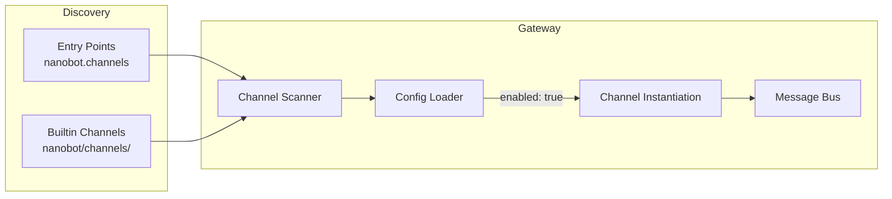

# Channel-Plugin-Entwicklung

Dieser Guide erklärt, wie du eigene Channel-Plugins für nanobot schreibst, um beliebige Plattformen anzubinden.

## Plugin-Architektur

nanobot findet Channel-Plugins über Python [Entry Points](https://packaging.python.org/en/latest/specifications/entry-points/). Beim Start scannt `nanobot gateway`:

1. **Built-in Channels** in `nanobot/channels/`
2. **Plugins** im Entry-Point-Group `nanobot.channels`

Ist `enabled: true` in der Config gesetzt, wird der Channel instanziiert.



## BaseChannel

Jedes Plugin erbt von `nanobot.channels.base.BaseChannel`.

### Pflichtmethoden

| Methode | Beschreibung |
|---------|--------------|
| `async def start()` | Muss blockieren. Verbindet zur Plattform und hört auf Nachrichten. Bei Fehlern beendet das Gateway den Channel. |
| `async def stop()`  | Setzt `self._running = False` und räumt auf. Wird beim Shutdown aufgerufen. |
| `async def send(msg: OutboundMessage)` | Versendet Antworten an die Plattform. |

### Hilfsmethoden

| Methode | Beschreibung |
|---------|--------------|
| `_handle_message(...)` | Veröffentlicht Nachrichten auf dem Bus nach `is_allowed()`-Check. |
| `is_allowed(sender_id)` | Prüft `config["allowFrom"]` (`"*"` = alle, `[]` = niemand). |
| `default_config()` | Gibt Default-Config zurück. Wird von `nanobot onboard` benutzt. |
| `transcribe_audio(path)` | Whisper-Transkription via Groq, falls konfiguriert. |
| `is_running` | Bool für `self._running`. |

### OutboundMessage

```python
@dataclass
class OutboundMessage:
    channel: str
    chat_id: str
    content: str
    media: list[str]
    metadata: dict
```

`metadata` kann `"_progress"` enthalten für Streaming-Updates.

## Namenskonventionen

| Element | Format | Beispiel |
|---------|--------|----------|
| PyPI-Paket | `nanobot-channel-{name}` | `nanobot-channel-webhook` |
| Entry Point Key | `{name}` | `webhook` |
| Config-Block | `channels.{name}` | `channels.webhook` |
| Python-Paket | `nanobot_channel_{name}` | `nanobot_channel_webhook` |

## Beispiel-Plugin: Webhook

### Struktur

```
nanobot-channel-webhook/
├── nanobot_channel_webhook/
│   ├── __init__.py
│   └── channel.py
└── pyproject.toml
```

### Channel-Implementation

```python
class WebhookChannel(BaseChannel):
    name = "webhook"

    @classmethod
    def default_config(cls) -> dict[str, Any]:
        return {"enabled": False, "port": 9000, "allowFrom": []}

    async def start(self) -> None:
        self._running = True
        port = self.config.get("port", 9000)
        app = web.Application()
        app.router.add_post("/message", self._on_request)
        runner = web.AppRunner(app)
        await runner.setup()
        site = web.TCPSite(runner, "0.0.0.0", port)
        await site.start()
        while self._running:
            await asyncio.sleep(1)
        await runner.cleanup()

    async def stop(self) -> None:
        self._running = False

    async def send(self, msg: OutboundMessage) -> None:
        logger.info("[webhook] -> {}: {}", msg.chat_id, msg.content[:80])

    async def _on_request(self, request: web.Request) -> web.Response:
        body = await request.json()
        await self._handle_message(
            sender_id=body.get("sender", "unknown"),
            chat_id=body.get("chat_id", "unknown"),
            content=body.get("text", ""),
            media=body.get("media", []),
        )
        return web.json_response({"ok": True})
```

### Entry Point

```toml
[project]
name = "nanobot-channel-webhook"
version = "0.1.0"
dependencies = ["nanobot", "aiohttp"]

[project.entry-points."nanobot.channels"]
webhook = "nanobot_channel_webhook:WebhookChannel"
```

### Installation & Activation

```bash
pip install -e .
nanobot plugins list  # Plugin sollte als "webhook" angezeigt werden
```

Aktiviere den Channel in `~/.nanobot/config.json`:

```json
{
  "channels": {
    "webhook": {
      "enabled": true,
      "port": 9000,
      "allowFrom": ["*"]
    }
  }
}
```

`allowFrom` wird vom BaseChannel verwaltet.

### Test-Ablauf

```bash
nanobot gateway

curl -X POST http://localhost:9000/message \
  -H "Content-Type: application/json" \
  -d '{"sender": "user1", "chat_id": "user1", "text": "Hallo!"}'
```

### Config-Zugriff

```python
port = self.config.get("port", 9000)
token = self.config.get("token", "")
```

### Default-Konfiguration definieren

```python
@classmethod
def default_config(cls) -> dict[str, Any]:
    return {
        "enabled": False,
        "port": 9000,
        "token": "",
        "webhookUrl": "",
        "allowFrom": [],
    }
```

### Lokale Entwicklung

```bash
git clone https://github.com/you/nanobot-channel-myplugin
cd nanobot-channel-myplugin
pip install -e .
nanobot plugins list
nanobot gateway
```

### Plugin-Status prüfen

```bash
nanobot plugins list
```

Ausgabe zeigt `builtin` vs. `plugin`.

### Streaming & Media

Verarbeite Medien durch Download oder direkte Weitergabe.

### Streaming-Status

`msg.metadata.get("_progress")` signalisiert Streaming-Antworten.

### Contribution zur Core

Für einen Core-Channel:

1. PR auf `nightly`
2. Channel in `nanobot/channels/` hinzufügen
3. Registration in `nanobot/channels/__init__.py`
4. Tests in `tests/`
5. `README.md` aktualisieren

Siehe auch [Contributing](./contributing.md).
