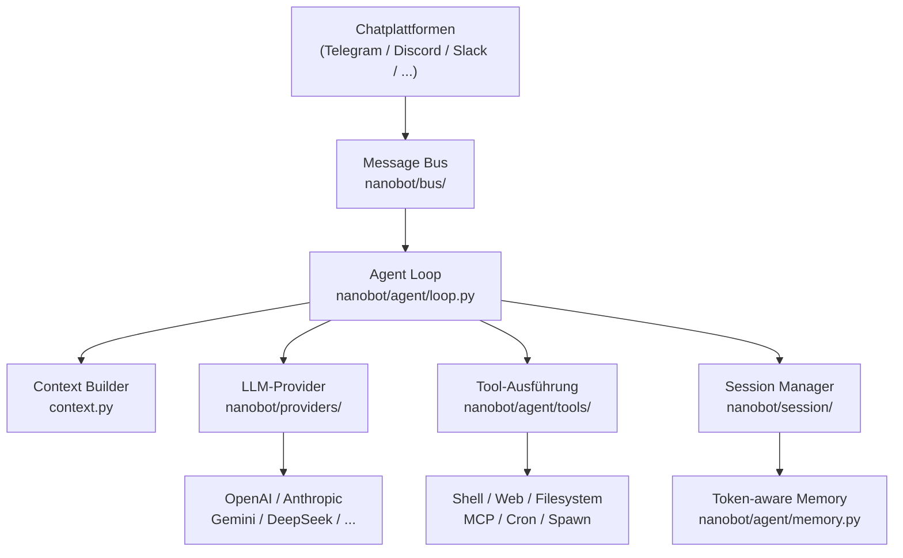

---
hide:
  - navigation
  - toc
---

<div class="hero-section">
  
  <h1 class="hero-title">Nanobot</h1>
  <p class="hero-subtitle">Ultraleichtes persönliches KI-Assistenten-Framework mit Unterstützung für 16+ Chatplattformen, 28+ LLM-Provider und kompletter MCP-Integration.</p>
  <div class="hero-badges">
    <span class="hero-badge">🐍 Python ≥ 3.11</span>
    <span class="hero-badge">📦 v0.1.4.post5</span>
    <span class="hero-badge">⚖️ MIT License</span>
    <span class="hero-badge">⚡ ~16k Zeilen Code</span>
    <span class="hero-badge">🔌 16+ Plattformen</span>
  </div>
  <div class="hero-buttons">
    <a href="getting-started/installation/" class="hero-btn hero-btn-primary">🚀 Jetzt starten</a>
    <a href="getting-started/quick-start/" class="hero-btn hero-btn-secondary">⚡ Schnellstart</a>
    <a href="https://github.com/HKUDS/nanobot" class="hero-btn hero-btn-secondary">★ GitHub</a>
  </div>
</div>

<div class="announcement-banner">
  🎉 <strong>Neueste Version v0.1.4.post5</strong> ist veröffentlicht! Mehr Zuverlässigkeit, bessere Kanalunterstützung und ein stabileres Alltagsgefühl.
  <a href="https://github.com/HKUDS/nanobot/releases/tag/v0.1.4.post5">Veröffentlichungshinweise anzeigen →</a>
</div>

---

## Kernfunktionen

<div class="feature-grid">
  <div class="feature-card">
    <span class="feature-icon">🪶</span>
    <p class="feature-title">Ultraleichtes Design</p>
    <p class="feature-desc">Nur etwa 16.000 Zeilen Python-Code – deutlich kleiner als OpenClaw. Minimaler Speicherbedarf und superschnelle Startzeit, damit Sie jederzeit einen persönlichen KI-Assistenten starten können.</p>
  </div>
  <div class="feature-card">
    <span class="feature-icon">🔌</span>
    <p class="feature-title">16+ Chatplattformen</p>
    <p class="feature-desc">Einmal deployen, überall kommunizieren: Telegram, Discord, Slack, Feishu, DingTalk, WeCom, QQ, Email, Matrix, WhatsApp und mehr werden unterstützt.</p>
  </div>
  <div class="feature-card">
    <span class="feature-icon">🧠</span>
    <p class="feature-title">28+ LLM-Provider</p>
    <p class="feature-desc">Kompatibel mit OpenAI, Anthropic, Gemini, DeepSeek, Qwen, Moonshot, MiniMax, VolcEngine, Azure OpenAI, lokalen Modellen (Ollama/vLLM) und weiteren.</p>
  </div>
  <div class="feature-card">
    <span class="feature-icon">🔧</span>
    <p class="feature-title">MCP-Integration</p>
    <p class="feature-desc">Volle Unterstützung für das Model Context Protocol (MCP): Schließen Sie externe Tools, Datenbanken und Services nahtlos in Ihren Agenten ein.</p>
  </div>
  <div class="feature-card">
    <span class="feature-icon">⏰</span>
    <p class="feature-title">Zeitplanung &amp; Cron</p>
    <p class="feature-desc">Der integrierte Natural-Language-Cron-Planer führt periodische Aufgaben aus und informiert Sie zur richtigen Zeit.</p>
  </div>
  <div class="feature-card">
    <span class="feature-icon">🎓</span>
    <p class="feature-title">Forschungsfreundlich</p>
    <p class="feature-desc">Eine saubere, leicht verständliche Codebasis, ideal für Forschung und schnelle Iterationen mit minimalem Overhead.</p>
  </div>
  <div class="feature-card">
    <span class="feature-icon">🛡️</span>
    <p class="feature-title">Token-basierte Speicherverwaltung</p>
    <p class="feature-desc">Die Kontextverwaltung bleibt konsistent, indem sie Tokenverbrauch überwacht und relevante Informationen behält.</p>
  </div>
  <div class="feature-card">
    <span class="feature-icon">🌐</span>
    <p class="feature-title">Mehrere Instanzen</p>
    <p class="feature-desc">Betreiben Sie gleichzeitig mehrere Nanobot-Instanzen mit eigenen Modellen, Kanälen und Workspaces.</p>
  </div>
  <div class="feature-card">
    <span class="feature-icon">💎</span>
    <p class="feature-title">Ein-Klick-Deployment</p>
    <p class="feature-desc">Der interaktive Setup-Assistent führt Sie in wenigen Minuten durch Installation, Konfiguration und Docker-/Linux-Service-Deployments.</p>
  </div>
</div>

---

## Schnellstatistik

<div class="stats-bar">
  <div class="stat-item">
    <span class="stat-number">16+</span>
    <span class="stat-label">Chatplattformen</span>
  </div>
  <div class="stat-item">
    <span class="stat-number">28+</span>
    <span class="stat-label">LLM-Provider</span>
  </div>
  <div class="stat-item">
    <span class="stat-number">~16k</span>
    <span class="stat-label">Zeilen Code</span>
  </div>
  <div class="stat-item">
    <span class="stat-number">99%</span>
    <span class="stat-label">leichter als OpenClaw</span>
  </div>
  <div class="stat-item">
    <span class="stat-number">MIT</span>
    <span class="stat-label">Open-Source-Lizenz</span>
  </div>
  <div class="stat-item">
    <span class="stat-number">3.11+</span>
    <span class="stat-label">Python-Version</span>
  </div>
</div>

---

## Unterstützte Chatkanäle

<div class="channel-grid">
  <a href="channels/telegram/" class="channel-badge">
    <span class="channel-icon">✈️</span>
    Telegram
  </a>
  <a href="channels/discord/" class="channel-badge">
    <span class="channel-icon">🎮</span>
    Discord
  </a>
  <a href="channels/slack/" class="channel-badge">
    <span class="channel-icon">💼</span>
    Slack
  </a>
  <a href="channels/feishu/" class="channel-badge">
    <span class="channel-icon">🪶</span>
    Feishu
  </a>
  <a href="channels/dingtalk/" class="channel-badge">
    <span class="channel-icon">🔔</span>
    DingTalk
  </a>
  <a href="channels/wecom/" class="channel-badge">
    <span class="channel-icon">💬</span>
    WeCom
  </a>
  <a href="channels/qq/" class="channel-badge">
    <span class="channel-icon">🐧</span>
    QQ
  </a>
  <a href="channels/email/" class="channel-badge">
    <span class="channel-icon">📧</span>
    Email
  </a>
  <a href="channels/matrix/" class="channel-badge">
    <span class="channel-icon">🔢</span>
    Matrix
  </a>
  <a href="channels/whatsapp/" class="channel-badge">
    <span class="channel-icon">📱</span>
    WhatsApp
  </a>
  <a href="channels/mochat/" class="channel-badge">
    <span class="channel-icon">🗨️</span>
    Mochat
  </a>
  <a href="cli-reference/" class="channel-badge">
    <span class="channel-icon">💻</span>
    CLI-Terminal
  </a>
</div>

---

## Unterstützte LLM-Provider

<div class="provider-grid">
  <div class="provider-badge">
    <span>🤖</span>
    <span class="provider-name">OpenAI</span>
    <span>GPT-4o, o1, o3</span>
  </div>
  <div class="provider-badge">
    <span>🧠</span>
    <span class="provider-name">Anthropic</span>
    <span>Claude 3.5/3.7</span>
  </div>
  <div class="provider-badge">
    <span>✨</span>
    <span class="provider-name">Gemini</span>
    <span>2.0 Flash, Pro</span>
  </div>
  <div class="provider-badge">
    <span>🌊</span>
    <span class="provider-name">DeepSeek</span>
    <span>V3, R1</span>
  </div>
  <div class="provider-badge">
    <span>🌙</span>
    <span class="provider-name">Moonshot / Kimi</span>
    <span>k1.5, k2</span>
  </div>
  <div class="provider-badge">
    <span>☁️</span>
    <span class="provider-name">Qwen</span>
    <span>Qwen2.5, QwQ</span>
  </div>
  <div class="provider-badge">
    <span>🚀</span>
    <span class="provider-name">VolcEngine</span>
    <span>Doubao-Serie</span>
  </div>
  <div class="provider-badge">
    <span>🔵</span>
    <span class="provider-name">Azure OpenAI</span>
    <span>Enterprise OpenAI</span>
  </div>
  <div class="provider-badge">
    <span>🔀</span>
    <span class="provider-name">OpenRouter</span>
    <span>200+ Modell-Routen</span>
  </div>
  <div class="provider-badge">
    <span>🦙</span>
    <span class="provider-name">Ollama</span>
    <span>Lokale Open-Source-Modelle</span>
  </div>
  <div class="provider-badge">
    <span>⚡</span>
    <span class="provider-name">vLLM</span>
    <span>Leistungsstarke lokale Inferenz</span>
  </div>
  <div class="provider-badge">
    <span>💎</span>
    <span class="provider-name">MiniMax</span>
    <span>ABAB-Serie</span>
  </div>
</div>

---

## Drei Schritte zum Einstieg

=== "Installation mit pip / uv"

    ```bash
    # Mit uv (empfohlen)
    uv tool install nanobot-ai

    # Oder mit pip
    pip install nanobot-ai
    ```

=== "Interaktiven Setup-Assistenten starten"

    ```bash
    # Starte den setup Wizard, der dich Schritt für Schritt konfiguriert
    nanobot onboard
    ```

=== "Mit nanobot chatten"

    ```bash
    # Interaktiven CLI-Agenten starten
    nanobot agent

    # Eine bestimmte Konfigurationsdatei verwenden
    nanobot agent --config ~/.nanobot/config.json

    # Einmalige Nachricht senden
    nanobot agent -m "Hello!"
    ```

---

## Architekturüberblick



---

## Neuigkeiten

<ul class="news-timeline">
  <li class="news-item">
    <div class="news-date">2026-03-16</div>
    <div class="news-text">🚀 Veröffentlichung von <strong>v0.1.4.post5</strong> – noch mehr Zuverlässigkeit, Kanalunterstützung und Alltagssicherheit.</div>
  </li>
  <li class="news-item">
    <div class="news-date">2026-03-15</div>
    <div class="news-text">🧩 DingTalk mit Rich Media, smartere eingebaute Skills und klarere Modellkompatibilität.</div>
  </li>
  <li class="news-item">
    <div class="news-date">2026-03-14</div>
    <div class="news-text">💬 Kanalplugins, Feishu-Antworten, zuverlässigere MCP- und QQ-/Medienverarbeitung.</div>
  </li>
  <li class="news-item">
    <div class="news-date">2026-03-13</div>
    <div class="news-text">🌐 Multi-Provider-Websuche, LangSmith-Integration und umfassende Zuverlässigkeitsverbesserungen.</div>
  </li>
  <li class="news-item">
    <div class="news-date">2026-03-08</div>
    <div class="news-text">🚀 Veröffentlichung von <strong>v0.1.4.post4</strong> – sicherere Defaults und bessere Multi-Instance-Unterstützung.</div>
  </li>
  <li class="news-item">
    <div class="news-date">2026-02-17</div>
    <div class="news-text">🎉 Veröffentlichung von <strong>v0.1.4</strong> – MCP, Fortschritts-Streaming, neue Provider und Kanalverbesserungen.</div>
  </li>
</ul>

<div style="text-align:center; margin-top: 1rem;">
  <a href="https://github.com/HKUDS/nanobot/releases" style="font-size:0.9rem; color: var(--md-primary-fg-color);">Alle Release-Notes anzeigen →</a>
</div>

---

## Community &amp; Support

<div class="feature-grid">
  <div class="feature-card">
    <span class="feature-icon">💬</span>
    <p class="feature-title">Discord-Community</p>
    <p class="feature-desc">Tritt der Discord-Community bei, tausche dich mit Nutzer:innen aus und erhalte direkte Hilfe.</p>
    <br>
    <a href="https://discord.gg/MnCvHqpUGB">Discord beitreten →</a>
  </div>
  <div class="feature-card">
    <span class="feature-icon">🐛</span>
    <p class="feature-title">Fehler melden</p>
    <p class="feature-desc">Entdecke einen Bug oder hast eine Idee? Öffne ein Issue auf GitHub, wir antworten schnell.</p>
    <br>
    <a href="https://github.com/HKUDS/nanobot/issues">Issue erstellen →</a>
  </div>
  <div class="feature-card">
    <span class="feature-icon">🤝</span>
    <p class="feature-title">Code beisteuern</p>
    <p class="feature-desc">Contribute per Pull Request – egal ob Dokumentation, Bugfix oder neue Kanal-/Provider-Integration.</p>
    <br>
    <a href="development/contributing/">Contributing →</a>
  </div>
</div>
