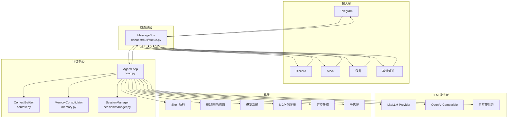
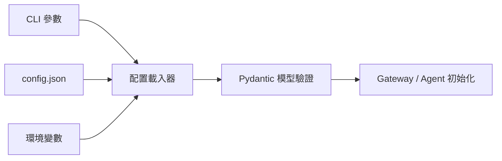

# 架構說明

## 設計理念

nanobot 採用**事件驅動、非同步優先**的設計，以極少的代碼實現完整的代理功能。核心思想是：

- **訊息總線**作為各元件之間的統一通訊介面
- **非同步協程**確保高並發下的資源效率
- **鬆散耦合**使每個元件可以獨立演進
- **單一責任**讓每個模組只做一件事

## 架構總覽



## 訊息資料流

一則使用者訊息從接收到回應的完整流程：

```mermaid
sequenceDiagram
    participant CH as 頻道介面卡
    participant BUS as 訊息總線
    participant LOOP as 代理循環
    participant CTX as 上下文建構器
    participant LLM as LLM 提供者
    participant TOOLS as 工具執行器
    participant SESS as 會話管理器

    CH->>BUS: InboundMessage（訊息內容、發送者、頻道）
    BUS->>LOOP: 分發至代理循環
    LOOP->>SESS: 載入/建立會話
    LOOP->>CTX: 建構上下文
    CTX->>CTX: 載入系統提示詞\n（身份、AGENTS.md、記憶、技能）
    CTX->>CTX: 載入歷史對話
    LOOP->>LLM: 呼叫 LLM（系統提示 + 歷史 + 新訊息）
    LLM-->>LOOP: 回應（文字或工具呼叫）

    loop 工具執行循環（最多 40 次）
        LOOP->>TOOLS: 執行工具（shell/web/fs/mcp...）
        TOOLS-->>LOOP: 工具結果
        LOOP->>LLM: 繼續推理
        LLM-->>LOOP: 最終回應或下一個工具呼叫
    end

    LOOP->>SESS: 儲存對話紀錄
    LOOP->>BUS: OutboundMessage（回應內容）
    BUS->>CH: 發送回應至頻道
```

## 核心模組說明

### CLI 入口點

**`nanobot/cli/commands.py`**

所有 CLI 指令的入口點。解析命令列參數後，根據子指令（`gateway`、`agent`、`status` 等）初始化對應的元件並啟動。

```bash
nanobot gateway   # 啟動 Gateway 服務
nanobot agent     # 啟動本地 CLI 代理
nanobot status    # 顯示配置狀態
nanobot onboard   # 執行設定精靈
```

### 訊息總線

**`nanobot/bus/`**

訊息總線是 Gateway 的核心路由層，負責：

- 接收來自各頻道的 `InboundMessage`
- 將訊息分發至代理循環
- 將代理的 `OutboundMessage` 路由至對應頻道

關鍵資料結構：

```python
@dataclass
class InboundMessage:
    channel: str        # 來源頻道名稱
    sender_id: str      # 發送者 ID
    chat_id: str        # 聊天室 ID
    content: str        # 訊息內容
    media: list[str]    # 媒體附件（URL 或本地路徑）
    metadata: dict      # 頻道特定的元資料

@dataclass
class OutboundMessage:
    channel: str        # 目標頻道名稱
    chat_id: str        # 接收者
    content: str        # 回應內容（Markdown）
    media: list[str]    # 附件檔案路徑
    metadata: dict      # 可包含 "_progress" 用於串流
```

### 代理循環

**`nanobot/agent/loop.py`** — `AgentLoop` 類別

代理的核心處理引擎，執行以下循環：

1. 從總線接收訊息
2. 透過 `ContextBuilder` 建構提示詞
3. 呼叫 LLM 提供者取得回應
4. 執行工具呼叫（若 LLM 要求）
5. 重複直到 LLM 給出最終文字回應
6. 將回應發布至總線

關鍵參數：

```python
AgentLoop(
    bus=bus,                          # 訊息總線
    provider=provider,                # LLM 提供者
    workspace=workspace,              # 工作區路徑
    max_iterations=40,                # 最大工具呼叫輪次
    context_window_tokens=65_536,     # 上下文視窗大小
    restrict_to_workspace=False,      # 是否限制工作區範圍
)
```

### 上下文建構器

**`nanobot/agent/context.py`** — `ContextBuilder` 類別

負責為每次 LLM 呼叫組裝完整的提示詞，包含：

- **身份資訊**：代理的基本身份和能力描述
- **啟動文件**：`AGENTS.md`、`SOUL.md`、`USER.md`、`TOOLS.md`（若存在於工作區）
- **記憶摘要**：長期記憶的壓縮摘要
- **活躍技能**：設定為「常駐」的技能內容
- **技能目錄**：可用技能的摘要列表
- **對話歷史**：當前會話的完整對話紀錄

### 記憶整合

**`nanobot/agent/memory.py`** — `MemoryConsolidator` 與 `MemoryStore`

Token 感知的記憶管理系統：

- **`MemoryStore`**：讀寫長期記憶（以檔案形式儲存於工作區）
- **`MemoryConsolidator`**：當對話歷史超過 Token 上限時，自動呼叫 LLM 壓縮並整合記憶

記憶整合流程：

```
對話歷史超過上下文視窗
  → MemoryConsolidator 提取未整合舊對話
  → 呼叫 LLM 生成 `history_entry` 與 `memory_update`
  → `history_entry` append 到 `memory/HISTORY.md`
  → `memory_update` 視內容是否變更而覆寫 `memory/MEMORY.md`
  → session 只移動 `last_consolidated` 游標，原始 messages 不會被刪除
```

### 頻道介面卡

**`nanobot/channels/`**

每個聊天平台都有一個對應的介面卡，繼承自 `BaseChannel`：

```
channels/
├── base.py         # BaseChannel 抽象類別
├── telegram.py     # Telegram Bot API
├── discord.py      # Discord.py
├── slack.py        # Slack Bolt
├── feishu.py       # 飛書開放平台
├── dingtalk.py     # 釘釘
├── wechat.py       # 企業微信
├── qq.py           # QQ（botpy SDK）
├── email.py        # SMTP/IMAP
├── matrix.py       # Matrix 協定
├── whatsapp.py     # WhatsApp（Node.js Bridge）
└── mochat.py       # Mochat
```

每個介面卡必須實作三個方法：

- `start()` — 連接平台並開始監聽（**必須永久阻塞**）
- `stop()` — 優雅關閉
- `send(msg)` — 發送訊息至平台

### LLM 提供者

**`nanobot/providers/`**

統一的 LLM 呼叫抽象層：

```
providers/
├── base.py              # LLMProvider 抽象類別
├── litellm_provider.py  # 主要提供者，透過 LiteLLM 支援 100+ 模型
└── ...                  # 自訂提供者
```

`LiteLLMProvider` 支援：Anthropic Claude、OpenAI GPT、Google Gemini、DeepSeek、Qwen、VolcEngine 等所有 LiteLLM 支援的模型。

### 工具執行

**`nanobot/agent/tools/`**

代理可呼叫的所有工具：

| 工具 | 模組 | 說明 |
|------|------|------|
| `exec` | `shell.py` | 執行 shell 指令 |
| `web_search` | `web.py` | 網路搜尋 |
| `web_fetch` | `web.py` | 抓取網頁內容 |
| `read_file` | `filesystem.py` | 讀取檔案 |
| `write_file` | `filesystem.py` | 寫入檔案 |
| `edit_file` | `filesystem.py` | 編輯檔案 |
| `list_dir` | `filesystem.py` | 列出目錄 |
| `mcp_*` | `mcp.py` | MCP 伺服器工具 |
| `cron_*` | `cron.py` | 定時任務管理 |
| `spawn` | `spawn.py` | 建立子代理 |
| `message` | `message.py` | 跨頻道發送訊息 |

### 會話管理

**`nanobot/session/manager.py`** — `SessionManager`

管理每個聊天室的對話狀態：

- 以 `chat_id` 為鍵維護獨立的會話
- 在對話之間持久化歷史紀錄
- 支援會話隔離（不同頻道的相同 `chat_id` 視為不同會話）

## 配置載入流程



配置以 Pydantic 模型定義，位於 `nanobot/config/schema.py`，提供：

- 自動型別驗證
- 預設值管理
- 清晰的配置文件結構

## 擴展 nanobot

### 新增頻道

繼承 `BaseChannel` 並透過 Python Entry Points 注冊。詳見 [頻道插件開發](./channel-plugin.md)。

### 新增技能

在工作區的 `skills/` 目錄中建立 `SKILL.md` 文件，代理會自動發現並使用。

### 新增 LLM 提供者

繼承 `LLMProvider` 並在 `providers/` 目錄中實作必要方法。

### 連接外部工具（MCP）

在配置文件中的 `mcp` 區塊定義 MCP 伺服器，代理會自動將其工具納入可用工具集。
