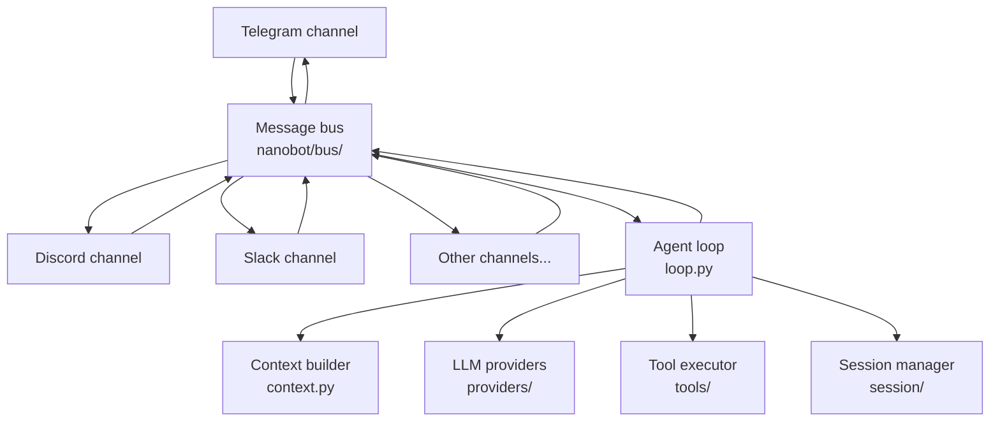

# Gateway service guide

## What is the Gateway?

The Gateway is a long-running nanobot service that simultaneously connects to multiple chat platforms (Telegram, Discord, Slack, Feishu, DingTalk, etc.) and routes all incoming messages to the agent processing engine.

Once the Gateway starts, it will:

1. Load the configuration file and initialize every enabled channel
2. Build the message bus
3. Launch dedicated listener coroutines for each channel
4. Continuously wait for messages and hand them to the agent loop
5. Send agent responses back to users via the matching channel

## Architecture overview



Message flow:

```
Channel receives a message
  → Message bus (InboundMessage)
    → AgentLoop
      → Context build (history + memory + skills)
      → LLM call
      → Tool execution (if needed)
      → Generate response
  → Message bus (OutboundMessage)
→ Channel sends reply
```

## Starting the Gateway

### Basic launch

```bash
nanobot gateway
```

This uses the default config (`~/.nanobot/config.json`) and listens on port `18790`.

### Specify a config file

```bash
nanobot gateway --config ~/.nanobot-telegram/config.json
```

### Specify a port

```bash
nanobot gateway --port 18792
```

### Specify a workspace

```bash
nanobot gateway --workspace /path/to/workspace
```

### Combine options

```bash
nanobot gateway --config ~/.nanobot-feishu/config.json --port 18792
```

## Multi-instance deployment

You can run multiple Gateway instances at once, each handling different channel sets:

```bash
# Instance A — Telegram bot
nanobot gateway --config ~/.nanobot-telegram/config.json

# Instance B — Discord bot
nanobot gateway --config ~/.nanobot-discord/config.json

# Instance C — Feishu bot (custom port)
nanobot gateway --config ~/.nanobot-feishu/config.json --port 18792
```

> **Important:** Each instance must use a unique port when running concurrently.

The port setting in the config file looks like:

```json
{
  "gateway": {
    "port": 18790
  }
}
```

## Heartbeat service

The Gateway includes a built-in **heartbeat service** that wakes up every 30 minutes to inspect `HEARTBEAT.md` in the workspace.

### How it works

1. Every 30 minutes, the Gateway reads `~/.nanobot/workspace/HEARTBEAT.md`
2. If unchecked tasks exist, the agent executes them
3. Results are sent to the most recently active chat channel

### HEARTBEAT.md task format

```markdown
- [ ] Report today’s weather at 9 a.m. daily
- [ ] Reminder to write the weekly report every Friday afternoon
- [ ] Check critical emails every hour
```

> **Tip:** Ask the bot to “add a recurring task,” and it will update `HEARTBEAT.md` automatically.

### Requirements

- The Gateway must be running (`nanobot gateway`)
- You must have spoken to the bot at least once so it knows which channel is active

## Checking status

### Overall system

```bash
nanobot status
```

Displays nanobot version, configured providers, workspace path, and other key info.

### Channel status

```bash
nanobot channels status
```

Shows which channels are enabled and their connection state.

### Plugin list

```bash
nanobot plugins list
```

Shows every built-in channel and plugin along with their enabled status.

## Graceful shutdown

Press `Ctrl+C` when running in the foreground to initiate a graceful shutdown:

1. Gateway receives SIGINT/SIGTERM
2. Stops listening on all channels
3. Waits for in-flight messages to finish processing
4. Cleans up resources and exits

When managed by systemd, stop it safely with:

```bash
systemctl --user stop nanobot-gateway
```

## Quick command reference

| Command | Description |
|------|------|
| `nanobot gateway` | Start the Gateway |
| `nanobot gateway --port 18792` | Start on a custom port |
| `nanobot gateway --config <path>` | Start with a specific config file |
| `nanobot status` | View overall status |
| `nanobot channels status` | View channel health |
| `nanobot plugins list` | List available plugins |
| `nanobot onboard` | Run the interactive setup wizard |