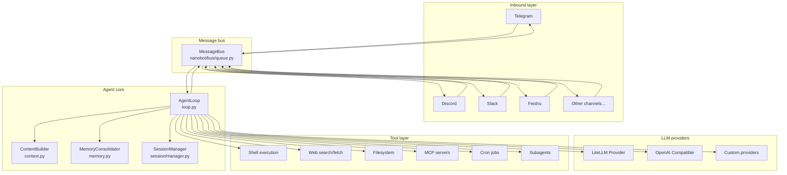
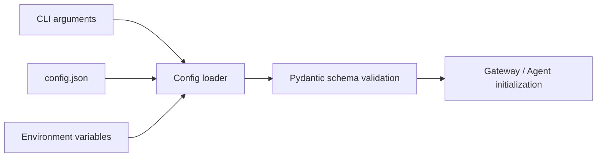

# Architecture overview

## Design principles

Nanobot follows an event-driven, async-first design to deliver a full agent experience with minimal code. Core principles include:

- **Message bus** acts as the unified communication layer between components
- **Async coroutines** keep resources efficient under high concurrency
- **Loose coupling** allows each component to evolve independently
- **Single responsibility** keeps modules focused on one concern

## System architecture



## Message data flow

A user message travels through the system as follows:

```mermaid
sequenceDiagram
    participant CH as Channel adapter
    participant BUS as Message bus
    participant LOOP as Agent loop
    participant CTX as Context builder
    participant LLM as LLM provider
    participant TOOLS as Tool executor
    participant SESS as Session manager

    CH->>BUS: InboundMessage (content, sender, channel)
    BUS->>LOOP: Route to agent loop
    LOOP->>SESS: Load or create session
    LOOP->>CTX: Build context
    CTX->>CTX: Load system prompts\n(identity, AGENTS.md, memories, skills)
    CTX->>CTX: Compose conversation history
    LOOP->>LLM: Call LLM (system + history + new user message)
    LLM-->>LOOP: Response (text or tool call)

    loop Tool execution loop (up to 40 iterations)
        LOOP->>TOOLS: Execute tool (shell/web/fs/mcp...)
        TOOLS-->>LOOP: Tool result
        LOOP->>LLM: Resume reasoning
        LLM-->>LOOP: Final response or next tool call
    end

    LOOP->>SESS: Persist conversation history
    LOOP->>BUS: OutboundMessage (response)
    BUS->>CH: Send response back to channel
```

## Core modules explained

### CLI entry points

**`nanobot/cli/commands.py`**

All CLI commands originate here. After parsing arguments, it initializes the appropriate component for each subcommand (`gateway`, `agent`, `status`, etc.).

```bash
nanobot gateway   # Start the gateway service
nanobot agent     # Run a local CLI agent
nanobot status    # Dump configuration status
nanobot onboard   # Run the interactive setup
```

### Message bus

**`nanobot/bus/`**

The bus is the gateway’s routing layer responsible for:

- Receiving `InboundMessage` from each channel
- Routing messages into the agent loop
- Routing `OutboundMessage` responses back to the appropriate channel

Key dataclasses:

```python
@dataclass
class InboundMessage:
    channel: str        # Source channel name
    sender_id: str      # Sender ID
    chat_id: str        # Chat room ID
    content: str        # Message content
    media: list[str]    # Media attachments (URLs or paths)
    metadata: dict      # Channel-specific metadata

@dataclass
class OutboundMessage:
    channel: str        # Target channel name
    chat_id: str        # Recipient chat ID
    content: str        # Markdown response
    media: list[str]    # Attachment file paths
    metadata: dict      # Can include `_progress` for streaming
```

### Agent loop

**`nanobot/agent/loop.py`** — `AgentLoop`

The core processing engine follows this loop:

1. Read a message from the bus
2. Build prompts via `ContextBuilder`
3. Call an LLM provider
4. Execute tool calls if requested
5. Repeat until the LLM yields a final text response
6. Publish the response back to the bus

Key parameters:

```python
AgentLoop(
    bus=bus,                          # Message bus
    provider=provider,                # LLM provider
    workspace=workspace,              # Workspace path
    max_iterations=40,                # Max tool call loop count
    context_window_tokens=65_536,     # Context window size
    restrict_to_workspace=False,      # Should tools be sandboxed?
)
```

### Context builder

**`nanobot/agent/context.py`** — `ContextBuilder`

Assembles each LLM call’s prompt, including:

- **Identity**: Basic persona and capability description
- **Boot documents**: `AGENTS.md`, `SOUL.md`, `USER.md`, `TOOLS.md` (if present)
- **Memory summaries**: Long-term memory compressed data
- **Active skills**: Skills marked as resident
- **Skills catalog**: Summary of available skills
- **Conversation history**: Full session transcripts

### Memory consolidation

**`nanobot/agent/memory.py`** — `MemoryConsolidator` and `MemoryStore`

Token-aware memory management:

- **`MemoryStore`**: Reads and writes long-term memories (stored in workspace files)
- **`MemoryConsolidator`**: When history exceeds the context window, it calls the LLM to compress old messages into summaries

Consolidation flow:

```
Conversation history exceeds context window
  → MemoryConsolidator extracts old messages
  → Calls the LLM to generate a summary
  → Appends the summary to `memory.md`
  → Removes the old messages from the active history
```

### Channel adapters

**`nanobot/channels/`**

Each chat platform has an adapter inheriting from `BaseChannel`:

```
channels/
├── base.py         # BaseChannel ABC
├── telegram.py     # Telegram Bot API
├── discord.py      # Discord.py
├── slack.py        # Slack Bolt
├── feishu.py       # Feishu Open Platform
├── dingtalk.py     # DingTalk
├── wechat.py       # WeCom
├── qq.py           # QQ (botpy SDK)
├── email.py        # SMTP/IMAP
├── matrix.py       # Matrix protocol
├── whatsapp.py     # WhatsApp (Node.js bridge)
└── mochat.py       # MoChat
```

Each adapter must implement:

- `start()` — connect to the platform and begin listening (must block)
- `stop()` — gracefully shut down
- `send(msg)` — dispatch a response to the channel

### LLM providers

**`nanobot/providers/`**

A unified abstraction layer for LLM calls:

```
providers/
├── base.py              # LLMProvider base class
├── litellm_provider.py  # Primary provider using LiteLLM for 100+ models
└── ...                  # Custom providers as needed
```

`LiteLLMProvider` covers Anthropic Claude, OpenAI GPT, Google Gemini, DeepSeek, Qwen, VolcEngine, and all LiteLLM-supported models.

### Tool execution

**`nanobot/agent/tools/`**

Available tools:

| Tool | Module | Description |
|------|--------|-------------|
| `exec` | `shell.py` | Run shell commands |
| `web_search` | `web.py` | Web search |
| `web_fetch` | `web.py` | Fetch web pages |
| `read_file` | `filesystem.py` | Read files |
| `write_file` | `filesystem.py` | Write files |
| `edit_file` | `filesystem.py` | Edit files |
| `list_dir` | `filesystem.py` | List directories |
| `mcp_*` | `mcp.py` | MCP server tools |
| `cron_*` | `cron.py` | Scheduled tasks |
| `spawn` | `spawn.py` | Spawn sub-agents |
| `message` | `message.py` | Send cross-channel messages |

### Session management

**`nanobot/session/manager.py`** — `SessionManager`

Manages state per chat:

- Maintains sessions keyed by `chat_id`
- Persists history between conversations
- Keeps channel isolation (same `chat_id` across platforms is treated as distinct sessions)

## Configuration loading



Configurations are defined with Pydantic models in `nanobot/config/schema.py`, which provide:

- Automatic type validation
- Default value management
- A clear, structured configuration layout

## Extending nanobot

### Add a channel

Inherit from `BaseChannel` and register via Python entry points. See the [Channel Plugin Guide](./channel-plugin.md).

### Add a skill

Place `SKILL.md` files under the workspace `skills/` directory. The agent auto-discovers and loads them.

### Add an LLM provider

Implement new providers by subclassing `LLMProvider` under `providers/`.

### Connect external tools (MCP)

Define MCP servers in the `mcp` section of the config; nanobot automatically registers their tools alongside built-in tools.
