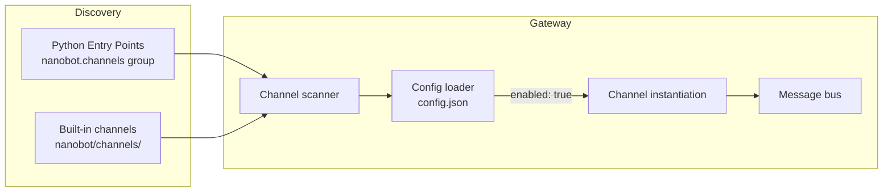

# Channel plugin development

This guide explains how to build custom channels so nanobot can connect to any platform you need.

## Plugin architecture overview

Nanobot discovers channel plugins via Python [Entry Points](https://packaging.python.org/en/latest/specifications/entry-points/). When `nanobot gateway` starts, it scans:

1. **Built-in channels:** Modules under `nanobot/channels/`
2. **External plugins:** Packages registered under the `nanobot.channels` entry point group

When the corresponding configuration block sets `"enabled": true`, nanobot instantiates and launches the channel.



## BaseChannel interface

All channel plugins must inherit from `nanobot.channels.base.BaseChannel`.

### Required methods

| Method | Description |
|------|------|
| `async start()` | Must block indefinitely. Connect to the platform, listen for messages, and call `_handle_message()` for each one. Returning means the channel died. |
| `async stop()` | Set `self._running = False` and clean up resources. Called when the gateway shuts down. |
| `async send(msg: OutboundMessage)` | Send a response to the platform. |

### Base class helpers

| Method / property | Description |
|------------|------|
| `_handle_message(sender_id, chat_id, content, media?, metadata?, session_key?)` | Call this when a message arrives. It checks `is_allowed()` and publishes the message to the bus. |
| `is_allowed(sender_id)` | Validates the sender against `config["allowFrom"]`. Use `"*"` to allow everyone, `[]` denies all. |
| `default_config()` (classmethod) | Returns the default config dictionary used by `nanobot onboard`. Override it to declare your fields. |
| `transcribe_audio(file_path)` | Transcribes audio via Groq Whisper (if configured). |
| `is_running` | Boolean flag for `self._running`. |

### OutboundMessage dataclass

```python
@dataclass
class OutboundMessage:
    channel: str        # Your channel name
    chat_id: str        # Recipient (same chat_id passed to _handle_message)
    content: str        # Markdown text — convert as needed for the platform
    media: list[str]    # Local file paths for attachments (images, audio, docs)
    metadata: dict      # May include `_progress` (bool) for streaming or `message_id` for replies
```

## Naming conventions

| Item | Format | Example |
|------|------|------|
| PyPI package | `nanobot-channel-{name}` | `nanobot-channel-webhook` |
| Entry point key | `{name}` | `webhook` |
| Config block | `channels.{name}` | `channels.webhook` |
| Python package | `nanobot_channel_{name}` | `nanobot_channel_webhook` |

## Full example: webhook channel

Here is a webhook plugin that accepts messages via HTTP POST.

### Project structure

```
nanobot-channel-webhook/
├── nanobot_channel_webhook/
│   ├── __init__.py          # Re-export WebhookChannel
│   └── channel.py           # Implementation
└── pyproject.toml
```

### Step 1: Implement the channel

```python
# nanobot_channel_webhook/__init__.py
from nanobot_channel_webhook.channel import WebhookChannel

__all__ = ["WebhookChannel"]
```

```python
# nanobot_channel_webhook/channel.py
import asyncio
from typing import Any

from aiohttp import web
from loguru import logger

from nanobot.channels.base import BaseChannel
from nanobot.bus.events import OutboundMessage


class WebhookChannel(BaseChannel):
    name = "webhook"
    display_name = "Webhook"

    @classmethod
    def default_config(cls) -> dict[str, Any]:
        """Declare this channel’s default config fields."
        return {"enabled": False, "port": 9000, "allowFrom": []}

    async def start(self) -> None:
        """Launch an HTTP server and block until stop() is called."""
        self._running = True
        port = self.config.get("port", 9000)

        app = web.Application()
        app.router.add_post("/message", self._on_request)
        runner = web.AppRunner(app)
        await runner.setup()
        site = web.TCPSite(runner, "0.0.0.0", port)
        await site.start()
        logger.info("Webhook listening on :{}", port)

        while self._running:
            await asyncio.sleep(1)

        await runner.cleanup()

    async def stop(self) -> None:
        self._running = False

    async def send(self, msg: OutboundMessage) -> None:
        logger.info("[webhook] -> {}: {}", msg.chat_id, msg.content[:80])
        # In a real plugin, POST back to the callback or use an SDK

    async def _on_request(self, request: web.Request) -> web.Response:
        body = await request.json()
        sender = body.get("sender", "unknown")
        chat_id = body.get("chat_id", sender)
        text = body.get("text", "")
        media = body.get("media", [])

        await self._handle_message(
            sender_id=sender,
            chat_id=chat_id,
            content=text,
            media=media,
        )

        return web.json_response({"ok": True})
```

### Step 2: Register the entry point

```toml
[project]
name = "nanobot-channel-webhook"
version = "0.1.0"
dependencies = ["nanobot", "aiohttp"]

[project.entry-points."nanobot.channels"]
webhook = "nanobot_channel_webhook:WebhookChannel"

[build-system]
requires = ["setuptools"]
build-backend = "setuptools.backends._legacy:_Backend"
```

The entry point key (`webhook`) becomes the config block name; the value points to your `BaseChannel` subclass.

### Step 3: Install and enable

```bash
pip install -e .
uv pip install -e .

nanobot plugins list
# Should show "Webhook" with source "plugin"
```

Then edit `~/.nanobot/config.json`:

```json
{
  "channels": {
    "webhook": {
      "enabled": true,
      "port": 9000,
      "allowFrom": ["*"]
    }
  }
}
```

> **Tip:** `allowFrom` is enforced by `_handle_message()`, so the plugin doesn’t need to re-check it. Use `"*"` to allow everyone.

### Step 4: Run and test

```bash
nanobot gateway
```

In another terminal:

```bash
curl -X POST http://localhost:9000/message \
  -H "Content-Type: application/json" \
  -d '{"sender": "user1", "chat_id": "user1", "text": "Hello!"}'
```

The agent processes the incoming message, and your `send()` method receives the response.

## Accessing configuration

Channel configs are available via `self.config`. Use `.get()` with defaults:

```python
async def start(self) -> None:
    port = self.config.get("port", 9000)
    token = self.config.get("token", "")
    webhook_url = self.config.get("webhookUrl", "")
```

Override `default_config()` so `nanobot onboard` can auto-fill `config.json`:

```python
@classmethod
def default_config(cls) -> dict[str, Any]:
    return {
        "enabled": False,
        "port": 9000,
        "token": "",
        "webhookUrl": "",
        "allowFrom": []
    }
```

The base class returns `{"enabled": false}` if you don’t override it.

## Local development workflow

```bash
git clone https://github.com/you/nanobot-channel-myplugin
git clone https://github.com/you/nanobot-channel-myplugin
cd nanobot-channel-myplugin

pip install -e .

nanobot plugins list
# Should list your channel as "plugin"

nanobot gateway
```

## Checking plugin status

```bash
nanobot plugins list

  Name       Source    Enabled
  telegram   builtin   yes
  discord    builtin   no
  webhook    plugin    yes
```

- `builtin`: built-in channels
- `plugin`: entry-point based plugins

## Handling media

```python
async def _on_request(self, request: web.Request) -> web.Response:
    body = await request.json()

    media_urls = body.get("media", [])
    local_paths = []

    for url in media_urls:
        path = await self._download_media(url)
        local_paths.append(path)

    await self._handle_message(
        sender_id=body["sender"],
        chat_id=body["chat_id"],
        content=body.get("text", ""),
        media=local_paths,
    )
    return web.json_response({"ok": True})
```

## Streaming responses

Set `_progress: True` in `OutboundMessage.metadata` to stream partial replies:

```python
async def send(self, msg: OutboundMessage) -> None:
    is_streaming = msg.metadata.get("_progress", False)

    if is_streaming:
        await self._update_message(msg.chat_id, msg.content)
    else:
        await self._send_final_message(msg.chat_id, msg.content)
```

## Submitting to the main repo

If your plugin becomes generally useful, consider making it built-in:

1. Open a PR against `nightly`
2. Add the channel under `nanobot/channels/your_channel.py`
3. Register it in `nanobot/channels/__init__.py`
4. Add tests under `tests/`
5. Update `README.md` channel list

See the [Contributing guide](./contributing.md) for more details.
