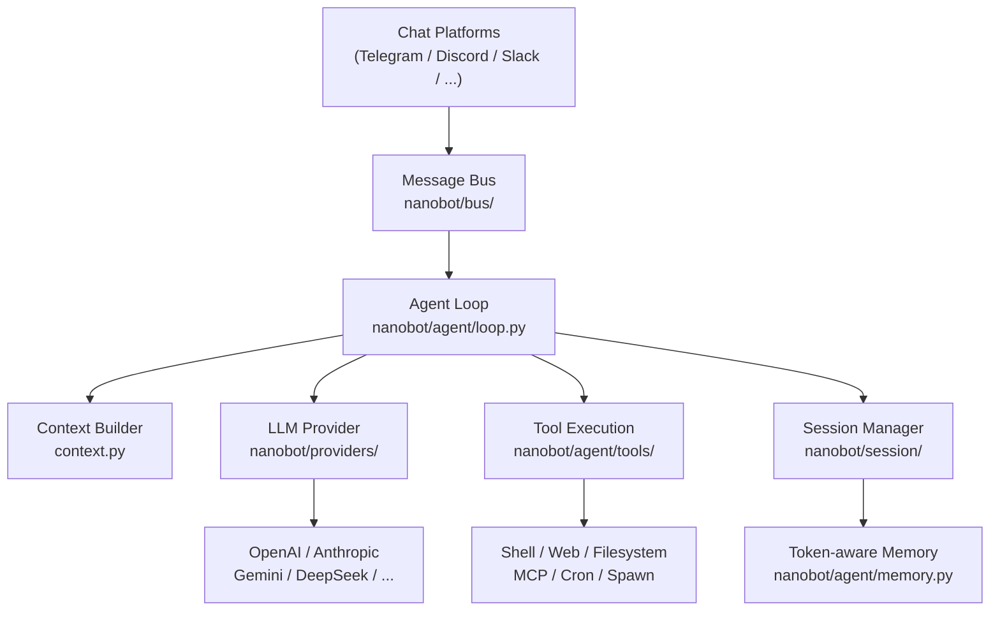

---
hide:
  - navigation
  - toc
---

<div class="hero-section">
  
  <h1 class="hero-title">Nanobot</h1>
  <p class="hero-subtitle">An ultra-lightweight personal AI assistant framework with support for 16+ chat platforms, 28+ LLM providers, and full MCP integration</p>
  <div class="hero-badges">
    <span class="hero-badge">🐍 Python ≥ 3.11</span>
    <span class="hero-badge">📦 v0.1.4.post5</span>
    <span class="hero-badge">⚖️ MIT License</span>
    <span class="hero-badge">⚡ ~16k lines of code</span>
    <span class="hero-badge">🔌 16+ platforms</span>
  </div>
  <div class="hero-buttons">
    <a href="getting-started/installation/" class="hero-btn hero-btn-primary">🚀 Get Started</a>
    <a href="getting-started/quick-start/" class="hero-btn hero-btn-secondary">⚡ Quick Start</a>
    <a href="https://github.com/HKUDS/nanobot" class="hero-btn hero-btn-secondary">★ GitHub</a>
  </div>
</div>

<div class="announcement-banner">
  🎉 <strong>Latest release v0.1.4.post5</strong> is now available! Improved reliability, stronger channel support, and a better day-to-day experience.
  <a href="https://github.com/HKUDS/nanobot/releases/tag/v0.1.4.post5">View release notes →</a>
</div>

---

## Core Features

<div class="feature-grid">
  <div class="feature-card">
    <span class="feature-icon">🪶</span>
    <p class="feature-title">Ultra-Lightweight Design</p>
    <p class="feature-desc">Only about 16,000 lines of Python code—99% smaller than OpenClaw. Minimal memory usage and faster startup let you launch your personal AI assistant anytime.</p>
  </div>
  <div class="feature-card">
    <span class="feature-icon">🔌</span>
    <p class="feature-title">16+ Chat Platforms</p>
    <p class="feature-desc">Deploy once, communicate everywhere. Comprehensive support for Telegram, Discord, Slack, Feishu, DingTalk, WeCom, QQ, Email, Matrix, WhatsApp, and more.</p>
  </div>
  <div class="feature-card">
    <span class="feature-icon">🧠</span>
    <p class="feature-title">28+ LLM Providers</p>
    <p class="feature-desc">Supports major providers including OpenAI, Anthropic, Gemini, DeepSeek, Qwen, Moonshot, MiniMax, VolcEngine, Azure OpenAI, and local models (Ollama/vLLM).</p>
  </div>
  <div class="feature-card">
    <span class="feature-icon">🔧</span>
    <p class="feature-title">MCP Integration</p>
    <p class="feature-desc">Full support for Model Context Protocol (MCP). Connect to any external tool, database, or service through a standard interface to significantly extend assistant capabilities.</p>
  </div>
  <div class="feature-card">
    <span class="feature-icon">⏰</span>
    <p class="feature-title">Scheduling & Cron</p>
    <p class="feature-desc">Built-in natural-language scheduling engine for reminders and recurring tasks, so your assistant can proactively contact you at the right time.</p>
  </div>
  <div class="feature-card">
    <span class="feature-icon">🎓</span>
    <p class="feature-title">Research-Friendly</p>
    <p class="feature-desc">Clean, readable architecture that is easy to understand, modify, and extend. No over-engineering—ideal for researchers and developers to explore deeply.</p>
  </div>
  <div class="feature-card">
    <span class="feature-icon">🛡️</span>
    <p class="feature-title">Token-Aware Memory Management</p>
    <p class="feature-desc">A token-aware memory consolidation system that automatically manages context windows to keep long-running conversations coherent and consistent.</p>
  </div>
  <div class="feature-card">
    <span class="feature-icon">🌐</span>
    <p class="feature-title">Multi-Instance Support</p>
    <p class="feature-desc">Run multiple Nanobot instances at the same time, each with independent models, channels, and skills for flexible use across different scenarios.</p>
  </div>
  <div class="feature-card">
    <span class="feature-icon">💎</span>
    <p class="feature-title">One-Click Deployment</p>
    <p class="feature-desc">Finish setup in minutes with the interactive onboarding wizard. Supports Docker container deployment and Linux systemd services for diverse environments.</p>
  </div>
</div>

---

## Quick Stats

<div class="stats-bar">
  <div class="stat-item">
    <span class="stat-number">16+</span>
    <span class="stat-label">Chat Platforms</span>
  </div>
  <div class="stat-item">
    <span class="stat-number">28+</span>
    <span class="stat-label">LLM Providers</span>
  </div>
  <div class="stat-item">
    <span class="stat-number">~16k</span>
    <span class="stat-label">Lines of Code</span>
  </div>
  <div class="stat-item">
    <span class="stat-number">99%</span>
    <span class="stat-label">Lighter than OpenClaw</span>
  </div>
  <div class="stat-item">
    <span class="stat-number">MIT</span>
    <span class="stat-label">Open Source License</span>
  </div>
  <div class="stat-item">
    <span class="stat-number">3.11+</span>
    <span class="stat-label">Python Version</span>
  </div>
</div>

---

## Supported Chat Channels

<div class="channel-grid">
  <a href="channels/telegram/" class="channel-badge">
    <span class="channel-icon">✈️</span>
    Telegram
  </a>
  <a href="channels/discord/" class="channel-badge">
    <span class="channel-icon">🎮</span>
    Discord
  </a>
  <a href="channels/slack/" class="channel-badge">
    <span class="channel-icon">💼</span>
    Slack
  </a>
  <a href="channels/feishu/" class="channel-badge">
    <span class="channel-icon">🪶</span>
    Feishu
  </a>
  <a href="channels/dingtalk/" class="channel-badge">
    <span class="channel-icon">🔔</span>
    DingTalk
  </a>
  <a href="channels/wecom/" class="channel-badge">
    <span class="channel-icon">💬</span>
    WeCom
  </a>
  <a href="channels/qq/" class="channel-badge">
    <span class="channel-icon">🐧</span>
    QQ
  </a>
  <a href="channels/email/" class="channel-badge">
    <span class="channel-icon">📧</span>
    Email
  </a>
  <a href="channels/matrix/" class="channel-badge">
    <span class="channel-icon">🔢</span>
    Matrix
  </a>
  <a href="channels/whatsapp/" class="channel-badge">
    <span class="channel-icon">📱</span>
    WhatsApp
  </a>
  <a href="channels/mochat/" class="channel-badge">
    <span class="channel-icon">🗨️</span>
    Mochat
  </a>
  <a href="cli-reference/" class="channel-badge">
    <span class="channel-icon">💻</span>
    CLI Terminal
  </a>
</div>

---

## Supported LLM Providers

<div class="provider-grid">
  <div class="provider-badge">
    <span>🤖</span>
    <span class="provider-name">OpenAI</span>
    <span>GPT-4o, o1, o3</span>
  </div>
  <div class="provider-badge">
    <span>🧠</span>
    <span class="provider-name">Anthropic</span>
    <span>Claude 3.5/3.7</span>
  </div>
  <div class="provider-badge">
    <span>✨</span>
    <span class="provider-name">Gemini</span>
    <span>2.0 Flash, Pro</span>
  </div>
  <div class="provider-badge">
    <span>🌊</span>
    <span class="provider-name">DeepSeek</span>
    <span>V3, R1</span>
  </div>
  <div class="provider-badge">
    <span>🌙</span>
    <span class="provider-name">Moonshot / Kimi</span>
    <span>k1.5, k2</span>
  </div>
  <div class="provider-badge">
    <span>☁️</span>
    <span class="provider-name">Qwen</span>
    <span>Qwen2.5, QwQ</span>
  </div>
  <div class="provider-badge">
    <span>🚀</span>
    <span class="provider-name">VolcEngine</span>
    <span>Doubao series</span>
  </div>
  <div class="provider-badge">
    <span>🔵</span>
    <span class="provider-name">Azure OpenAI</span>
    <span>Enterprise OpenAI</span>
  </div>
  <div class="provider-badge">
    <span>🔀</span>
    <span class="provider-name">OpenRouter</span>
    <span>200+ model routing</span>
  </div>
  <div class="provider-badge">
    <span>🦙</span>
    <span class="provider-name">Ollama</span>
    <span>Local open-source models</span>
  </div>
  <div class="provider-badge">
    <span>⚡</span>
    <span class="provider-name">vLLM</span>
    <span>High-performance local inference</span>
  </div>
  <div class="provider-badge">
    <span>💎</span>
    <span class="provider-name">MiniMax</span>
    <span>ABAB series</span>
  </div>
</div>

---

## Quick Start in 3 Steps

=== "Install with pip / uv"

    ```bash
    # Using uv (recommended)
    uv tool install nanobot-ai

    # Or using pip
    pip install nanobot-ai
    ```

=== "Launch interactive onboarding wizard"

    ```bash
    # Launch the setup wizard and finish configuration step by step
    nanobot onboard
    ```

=== "Start chatting with nanobot"

    ```bash
    # Start the interactive CLI agent
    nanobot agent

    # Use a specific config file
    nanobot agent --config ~/.nanobot/config.json

    # One-off message mode
    nanobot agent -m "Hello!"
    ```

---

## Architecture Overview



---

## Latest Updates

<ul class="news-timeline">
  <li class="news-item">
    <div class="news-date">2026-03-16</div>
    <div class="news-text">🚀 Released <strong>v0.1.4.post5</strong> — improved reliability, stronger channel support, and a more dependable day-to-day experience</div>
  </li>
  <li class="news-item">
    <div class="news-date">2026-03-15</div>
    <div class="news-text">🧩 DingTalk rich media, smarter built-in skills, and cleaner model compatibility</div>
  </li>
  <li class="news-item">
    <div class="news-date">2026-03-14</div>
    <div class="news-text">💬 Channel plugins, Feishu replies, steadier MCP, QQ, and media handling</div>
  </li>
  <li class="news-item">
    <div class="news-date">2026-03-13</div>
    <div class="news-text">🌐 Multi-provider web search, LangSmith integration, and broader reliability improvements</div>
  </li>
  <li class="news-item">
    <div class="news-date">2026-03-08</div>
    <div class="news-text">🚀 Released <strong>v0.1.4.post4</strong> — safer defaults and better multi-instance support</div>
  </li>
  <li class="news-item">
    <div class="news-date">2026-02-17</div>
    <div class="news-text">🎉 Released <strong>v0.1.4</strong> — MCP support, progress streaming, new providers, and multiple channel improvements</div>
  </li>
</ul>

<div style="text-align:center; margin-top: 1rem;">
  <a href="https://github.com/HKUDS/nanobot/releases" style="font-size:0.9rem; color: var(--md-primary-fg-color);">View full release history →</a>
</div>

---

## Community & Support

<div class="feature-grid">
  <div class="feature-card">
    <span class="feature-icon">💬</span>
    <p class="feature-title">Discord Community</p>
    <p class="feature-desc">Join our Discord community to discuss with other users, get real-time support, and stay updated on the latest news.</p>
    <br>
    <a href="https://discord.gg/MnCvHqpUGB">Join Discord →</a>
  </div>
  <div class="feature-card">
    <span class="feature-icon">🐛</span>
    <p class="feature-title">Issue Reporting</p>
    <p class="feature-desc">Found a bug or have a feature suggestion? Tell us through GitHub Issues—we actively respond.</p>
    <br>
    <a href="https://github.com/HKUDS/nanobot/issues">Submit an Issue →</a>
  </div>
  <div class="feature-card">
    <span class="feature-icon">🤝</span>
    <p class="feature-title">Contribute Code</p>
    <p class="feature-desc">Contributions are welcome via Pull Requests, including code, docs, and new channel/provider integrations.</p>
    <br>
    <a href="development/contributing/">Contribution Guide →</a>
  </div>
</div>
