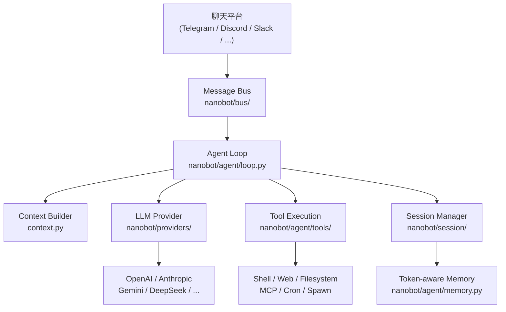

---
hide:
  - navigation
  - toc
---

<div class="hero-section">
  
  <h1 class="hero-title">Nanobot</h1>
  <p class="hero-subtitle">超輕量個人 AI 助理框架，支援 16+ 聊天平台、28+ LLM 提供商，以及完整 MCP 整合</p>
  <div class="hero-badges">
    <span class="hero-badge">🐍 Python ≥ 3.11</span>
    <span class="hero-badge">📦 v0.1.4.post5</span>
    <span class="hero-badge">⚖️ MIT License</span>
    <span class="hero-badge">⚡ ~16k 行程式碼</span>
    <span class="hero-badge">🔌 16+ 平台</span>
  </div>
  <div class="hero-buttons">
    <a href="getting-started/installation/" class="hero-btn hero-btn-primary">🚀 立即開始</a>
    <a href="getting-started/quick-start/" class="hero-btn hero-btn-secondary">⚡ 快速入門</a>
    <a href="https://github.com/HKUDS/nanobot" class="hero-btn hero-btn-secondary">★ GitHub</a>
  </div>
</div>

<div class="announcement-banner">
  🎉 <strong>最新版本 v0.1.4.post5</strong> 已發布！更強的可靠性、頻道支援與日常使用體驗。
  <a href="https://github.com/HKUDS/nanobot/releases/tag/v0.1.4.post5">查看發布說明 →</a>
</div>

---

## 核心特色

<div class="feature-grid">
  <div class="feature-card">
    <span class="feature-icon">🪶</span>
    <p class="feature-title">超輕量設計</p>
    <p class="feature-desc">僅約 16,000 行 Python 程式碼，比 OpenClaw 小 99%。極小的記憶體佔用、更快的啟動速度，讓您隨時啟動個人 AI 助理。</p>
  </div>
  <div class="feature-card">
    <span class="feature-icon">🔌</span>
    <p class="feature-title">16+ 聊天平台</p>
    <p class="feature-desc">一次部署，處處溝通。Telegram、Discord、Slack、飛書、釘釘、企業微信、QQ、Email、Matrix、WhatsApp 等全面支援。</p>
  </div>
  <div class="feature-card">
    <span class="feature-icon">🧠</span>
    <p class="feature-title">28+ LLM 提供商</p>
    <p class="feature-desc">支援 OpenAI、Anthropic、Gemini、DeepSeek、Qwen、Moonshot、MiniMax、VolcEngine、Azure OpenAI、本地模型 (Ollama/vLLM) 等主流提供商。</p>
  </div>
  <div class="feature-card">
    <span class="feature-icon">🔧</span>
    <p class="feature-title">MCP 整合</p>
    <p class="feature-desc">完整支援 Model Context Protocol (MCP)，透過標準介面接入任意外部工具、資料庫和服務，大幅擴展 AI 助理的能力邊界。</p>
  </div>
  <div class="feature-card">
    <span class="feature-icon">⏰</span>
    <p class="feature-title">排程與 Cron</p>
    <p class="feature-desc">內建自然語言排程引擎，可設定定時提醒、週期性任務，讓 AI 助理在正確時刻主動聯絡您。</p>
  </div>
  <div class="feature-card">
    <span class="feature-icon">🎓</span>
    <p class="feature-title">研究友好</p>
    <p class="feature-desc">乾淨、可讀的程式碼架構，易於理解、修改和擴展。無過度工程化，適合研究人員和開發者深入探索。</p>
  </div>
  <div class="feature-card">
    <span class="feature-icon">🛡️</span>
    <p class="feature-title">Token 記憶管理</p>
    <p class="feature-desc">基於 Token 感知的記憶整合系統，自動管理上下文視窗，確保長期對話的連貫性與一致性。</p>
  </div>
  <div class="feature-card">
    <span class="feature-icon">🌐</span>
    <p class="feature-title">多實例支援</p>
    <p class="feature-desc">可同時運行多個 Nanobot 實例，每個實例獨立設定不同的模型、頻道和技能，靈活應對各種使用場景。</p>
  </div>
  <div class="feature-card">
    <span class="feature-icon">💎</span>
    <p class="feature-title">一鍵部署</p>
    <p class="feature-desc">透過互動式設定精靈，幾分鐘內完成設定。支援 Docker 容器化部署和 Linux Systemd 服務，適合各種部署環境。</p>
  </div>
</div>

---

## 快速統計

<div class="stats-bar">
  <div class="stat-item">
    <span class="stat-number">16+</span>
    <span class="stat-label">聊天平台</span>
  </div>
  <div class="stat-item">
    <span class="stat-number">28+</span>
    <span class="stat-label">LLM 提供商</span>
  </div>
  <div class="stat-item">
    <span class="stat-number">~16k</span>
    <span class="stat-label">行程式碼</span>
  </div>
  <div class="stat-item">
    <span class="stat-number">99%</span>
    <span class="stat-label">比 OpenClaw 更輕量</span>
  </div>
  <div class="stat-item">
    <span class="stat-number">MIT</span>
    <span class="stat-label">開源授權</span>
  </div>
  <div class="stat-item">
    <span class="stat-number">3.11+</span>
    <span class="stat-label">Python 版本</span>
  </div>
</div>

---

## 支援的聊天頻道

<div class="channel-grid">
  <a href="channels/telegram/" class="channel-badge">
    <span class="channel-icon">✈️</span>
    Telegram
  </a>
  <a href="channels/discord/" class="channel-badge">
    <span class="channel-icon">🎮</span>
    Discord
  </a>
  <a href="channels/slack/" class="channel-badge">
    <span class="channel-icon">💼</span>
    Slack
  </a>
  <a href="channels/feishu/" class="channel-badge">
    <span class="channel-icon">🪶</span>
    飛書 Feishu
  </a>
  <a href="channels/dingtalk/" class="channel-badge">
    <span class="channel-icon">🔔</span>
    釘釘 DingTalk
  </a>
  <a href="channels/wecom/" class="channel-badge">
    <span class="channel-icon">💬</span>
    企業微信 WeCom
  </a>
  <a href="channels/qq/" class="channel-badge">
    <span class="channel-icon">🐧</span>
    QQ
  </a>
  <a href="channels/email/" class="channel-badge">
    <span class="channel-icon">📧</span>
    Email
  </a>
  <a href="channels/matrix/" class="channel-badge">
    <span class="channel-icon">🔢</span>
    Matrix
  </a>
  <a href="channels/whatsapp/" class="channel-badge">
    <span class="channel-icon">📱</span>
    WhatsApp
  </a>
  <a href="channels/mochat/" class="channel-badge">
    <span class="channel-icon">🗨️</span>
    Mochat
  </a>
  <a href="cli-reference/" class="channel-badge">
    <span class="channel-icon">💻</span>
    CLI 終端機
  </a>
</div>

---

## 支援的 LLM 提供商

<div class="provider-grid">
  <div class="provider-badge">
    <span>🤖</span>
    <span class="provider-name">OpenAI</span>
    <span>GPT-4o, o1, o3</span>
  </div>
  <div class="provider-badge">
    <span>🧠</span>
    <span class="provider-name">Anthropic</span>
    <span>Claude 3.5/3.7</span>
  </div>
  <div class="provider-badge">
    <span>✨</span>
    <span class="provider-name">Gemini</span>
    <span>2.0 Flash, Pro</span>
  </div>
  <div class="provider-badge">
    <span>🌊</span>
    <span class="provider-name">DeepSeek</span>
    <span>V3, R1</span>
  </div>
  <div class="provider-badge">
    <span>🌙</span>
    <span class="provider-name">Moonshot / Kimi</span>
    <span>k1.5, k2</span>
  </div>
  <div class="provider-badge">
    <span>☁️</span>
    <span class="provider-name">Qwen</span>
    <span>Qwen2.5, QwQ</span>
  </div>
  <div class="provider-badge">
    <span>🚀</span>
    <span class="provider-name">VolcEngine</span>
    <span>Doubao 系列</span>
  </div>
  <div class="provider-badge">
    <span>🔵</span>
    <span class="provider-name">Azure OpenAI</span>
    <span>企業版 OpenAI</span>
  </div>
  <div class="provider-badge">
    <span>🔀</span>
    <span class="provider-name">OpenRouter</span>
    <span>200+ 模型路由</span>
  </div>
  <div class="provider-badge">
    <span>🦙</span>
    <span class="provider-name">Ollama</span>
    <span>本地開源模型</span>
  </div>
  <div class="provider-badge">
    <span>⚡</span>
    <span class="provider-name">vLLM</span>
    <span>高效能本地推理</span>
  </div>
  <div class="provider-badge">
    <span>💎</span>
    <span class="provider-name">MiniMax</span>
    <span>ABAB 系列</span>
  </div>
</div>

---

## 三步驟快速上手

=== "使用 pip / uv 安裝"

    ```bash
    # 使用 uv（推薦）
    uv tool install nanobot-ai

    # 或使用 pip
    pip install nanobot-ai
    ```

=== "啟動互動設定精靈"

    ```bash
    # 啟動設定精靈，一步一步完成設定
    nanobot onboard
    ```

=== "運行 Nanobot"

    ```bash
    # 啟動 nanobot（讀取預設設定檔）
    nanobot run

    # 指定設定檔
    nanobot run --config my-config.toml

    # CLI 模式（無需聊天平台）
    nanobot chat
    ```

!!! tip "想先搞懂記憶功能？"
    建議先看 [記憶功能入門](getting-started/memory.md)，了解預設行為、啟用 mem0 的時機與設定方式。

---

## 架構概覽



---

## 最新動態

<ul class="news-timeline">
  <li class="news-item">
    <div class="news-date">2026-03-16</div>
    <div class="news-text">🚀 發布 <strong>v0.1.4.post5</strong> — 更強的可靠性、頻道支援與日常使用體驗</div>
  </li>
  <li class="news-item">
    <div class="news-date">2026-03-15</div>
    <div class="news-text">🧩 釘釘富媒體、更智慧的內建技能、更整潔的模型相容性</div>
  </li>
  <li class="news-item">
    <div class="news-date">2026-03-14</div>
    <div class="news-text">💬 頻道插件、飛書回覆、穩定的 MCP、QQ 與媒體處理</div>
  </li>
  <li class="news-item">
    <div class="news-date">2026-03-13</div>
    <div class="news-text">🌐 多提供商網頁搜尋、LangSmith 整合、廣泛可靠性改進</div>
  </li>
  <li class="news-item">
    <div class="news-date">2026-03-08</div>
    <div class="news-text">🚀 發布 <strong>v0.1.4.post4</strong> — 更安全的預設值、更佳的多實例支援</div>
  </li>
  <li class="news-item">
    <div class="news-date">2026-02-17</div>
    <div class="news-text">🎉 發布 <strong>v0.1.4</strong> — MCP 支援、進度串流、新提供商和多頻道改進</div>
  </li>
</ul>

<div style="text-align:center; margin-top: 1rem;">
  <a href="https://github.com/HKUDS/nanobot/releases" style="font-size:0.9rem; color: var(--md-primary-fg-color);">查看所有版本發布歷史 →</a>
</div>

---

## 社群與支援

<div class="feature-grid">
  <div class="feature-card">
    <span class="feature-icon">💬</span>
    <p class="feature-title">Discord 社群</p>
    <p class="feature-desc">加入我們的 Discord 社群，與其他使用者交流、獲取即時支援和最新消息。</p>
    <br>
    <a href="https://discord.gg/MnCvHqpUGB">加入 Discord →</a>
  </div>
  <div class="feature-card">
    <span class="feature-icon">🐛</span>
    <p class="feature-title">問題回報</p>
    <p class="feature-desc">發現 Bug 或有功能建議？透過 GitHub Issues 告訴我們，我們會積極回應。</p>
    <br>
    <a href="https://github.com/HKUDS/nanobot/issues">提交 Issue →</a>
  </div>
  <div class="feature-card">
    <span class="feature-icon">🤝</span>
    <p class="feature-title">貢獻程式碼</p>
    <p class="feature-desc">歡迎透過 Pull Request 貢獻程式碼、文件或新的頻道/提供商整合。</p>
    <br>
    <a href="development/contributing/">貢獻指南 →</a>
  </div>
</div>
